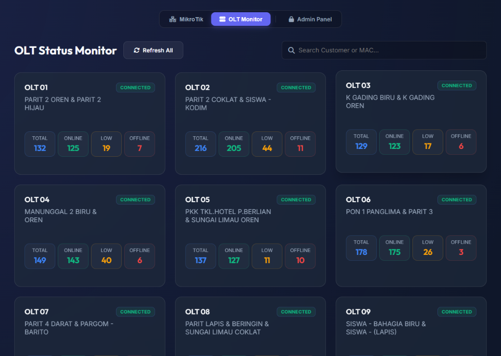

<p align="center">
  
</p>

<h1 align="center">MiksTraffic - MikroTik & OLT Monitoring System</h1>

<p align="center">
  <strong>Aplikasi monitoring trafik jaringan berbasis web yang sangat ringan, cepat, dan dilengkapi notifikasi WhatsApp.</strong><br>
  Sangat cocok untuk RT/RW Net atau ISP skala kecil-menengah yang membutuhkan sistem pantau *real-time* tanpa konfigurasi yang rumit. Dapat dijalankan di Linux maupun Windows!
</p>

---

## ✨ Fitur Unggulan

### 📊 Real-Time & Historical Traffic
Pantau terus pergerakan *bandwidth* di jaringan Anda. MiksTraffic menyimpan data historis untuk mempermudah analisis kapasitas jaringan.
- **Live Traffic**: Pembaruan per 1 menit secara mulus (*spanGaps* support).
- **History**: Lihat kilas balik data 24 Jam, Mingguan, hingga Bulanan.


### 🔌 Multi-Router & Multi-Interface
Tidak terbatas hanya pada satu router. Anda bisa mengkoneksikan banyak router MikroTik sekaligus dalam satu *dashboard*.
- Pilih *interface* mana saja yang ingin dipantau (WAN, Bridge, SFP, dll).


### 🏢 OLT Status Monitor
Selain router, Anda juga bisa memantau status perangkat OLT (Optical Line Terminal) di seluruh jaringan Anda.
- Pantau jumlah total pelanggan, pelanggan *online*, sinyal lemah (*low*), dan *offline*.



### 📲 WhatsApp Alert Notifications (Baileys)
Dapatkan peringatan seketika saat trafik jaringan Anda anjlok atau putus!
- Notifikasi dikirim otomatis via API WhatsApp Baileys.
- *Threshold* (Batas bawah trafik) dapat disesuaikan.
- Interval pengecekan aman dari *spam*.

### 👥 Multi-Admin Management
Sistem *login* yang aman dengan kemampuan untuk menambah banyak akun administrator untuk tim NOC Anda.


---

## 🛠️ Prasyarat Sistem

Aplikasi ini tidak membutuhkan spesifikasi *server* yang tinggi dan **Bisa Berjalan di Windows maupun Linux**.

### Untuk Linux (Ubuntu/Debian, dll):
- **Web Server & PHP**: Nginx/Apache dan PHP 7.4/8.x (dengan ekstensi `sqlite3`, `curl`, `json`).
- **PM2**: Dibutuhkan untuk menjalankan *background daemon* (Install via `npm install -g pm2`).

### Untuk Windows:
- **XAMPP / Laragon**: Berfungsi sebagai penyedia Web Server (Apache) dan PHP. Sangat mudah digunakan! Pastikan ekstensi `pdo_sqlite` dan `curl` aktif di `php.ini`.
- **Node.js**: Opsional, hanya dibutuhkan jika Anda ingin menggunakan PM2 di Windows. (Jika tidak ingin instal Node.js, Anda cukup meng-klik dua kali file `.bat` bawaan).

---

## 🚀 Panduan Instalasi (Deployment)

### 🐧 A. Instalasi di LINUX

**1. Ekstrak File**
Pindahkan seluruh isi repositori ini ke dalam direktori publik web server Anda (contoh: `/var/www/html/MRTG`).

**2. Atur Hak Akses (Permissions)**
Aplikasi ini membutuhkan hak tulis pada folder `data` agar SQLite dapat bekerja:
```bash
cd /var/www/html/MRTG
sudo chmod -R 777 data
```

**3. Menjalankan Perekam Data (Daemon)**
Agar aplikasi dapat merekam trafik setiap waktu, jalankan *background service* dengan **PM2**:
```bash
cd /var/www/html/MRTG
chmod +x daemon_curl.sh
chmod +x daemon_wa.sh

# Jalankan daemon ke dalam PM2
pm2 start bash --name mrtg-recorder -- daemon_curl.sh
pm2 start bash --name mrtg-wa-checker -- daemon_wa.sh
pm2 save
pm2 startup
```

---

### 🪟 B. Instalasi Mudah di WINDOWS (Standalone)

Kabar baik untuk pengguna Windows! Anda tidak perlu repot *setting* XAMPP/Laragon atau instalasi PM2. Saya sudah menyediakan sistem *Standalone* (Mandiri) menggunakan server bawaan PHP. Syaratnya: Komputer Anda hanya perlu terinstal PHP (bisa bawaan XAMPP atau *download* manual PHP for Windows) dan didaftarkan ke *Environment Variables* (Path).

**Langkah Menjalankan di Windows:**
1. Ekstrak folder `MRTG` di mana saja (misalnya di Desktop atau `D:\`).
2. Masuk ke dalam folder **`run_windows`**.
3. **Mulai Server Utama:** Klik dua kali file **`1_start_server.bat`**. Sebuah jendela CMD akan terbuka, dan browser Anda akan otomatis membuka halaman `http://localhost:8888`. Biarkan jendela CMD tersebut tetap terbuka.
4. **Mulai Daemon Perekam:** Klik dua kali file **`2_start_daemons_hidden.vbs`**. File ini akan menjalankan perekam grafik dan pengecek WhatsApp di *Latar Belakang* (Background) secara gaib tanpa menampilkan jendela hitam apa pun! Jauh lebih rapi.
5. **Selesai!** Aplikasi Anda sudah berjalan sempurna.

*(Jika Anda ingin mematikan daemon yang berjalan di latar belakang tersebut, cukup klik file `3_stop_all_hidden_daemons.bat`).*

---

## ⚙️ Langkah Lanjutan (Untuk Semua OS)

### Akses Dashboard Pertama Kali
Buka aplikasi di browser Anda: `http://localhost/MRTG` (atau IP server Anda). Aplikasi akan otomatis membuat database baru dan menyiapkan satu akun administrator.

Kredensial bawaan:
> **Username**: `admin` <br>
> **Password**: `admin123`

*(⚠️ Ganti password ini melalui menu Settings setelah login!)*

### Pengaturan Notifikasi WhatsApp
Untuk mengaktifkan fitur WhatsApp Alert:
1. Pergi ke menu **Settings** di Admin Panel.
2. Masukkan URL API Baileys Anda.
3. Masukkan Target Phone Number (contoh: `62812...`).
4. Setel batas batas bawah trafik (Threshold) dalam hitungan Mbps dan Interval waktu.

---
<p align="center">
  Dibuat dengan ❤️ untuk Network Engineer.
</p>
