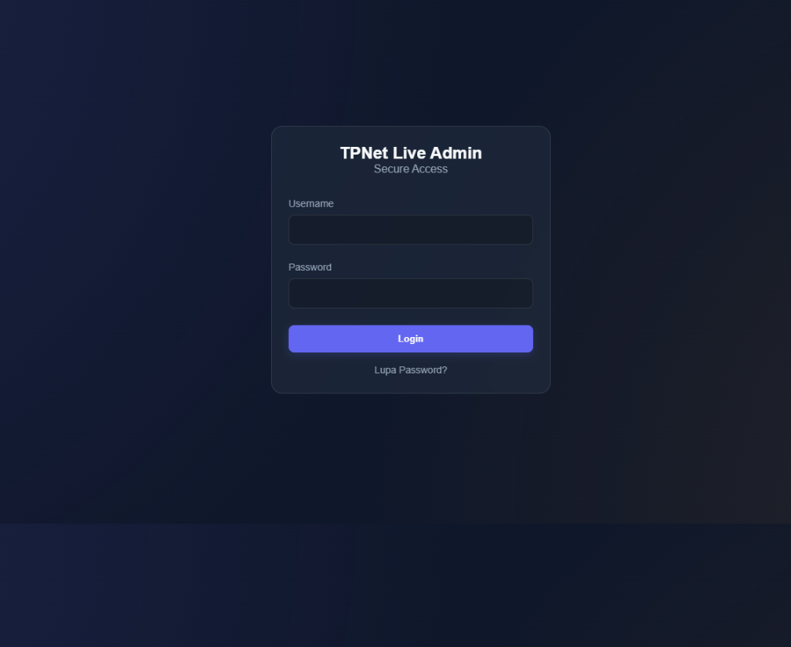
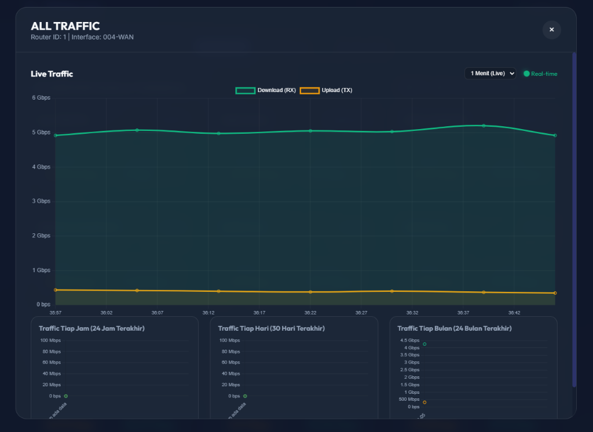
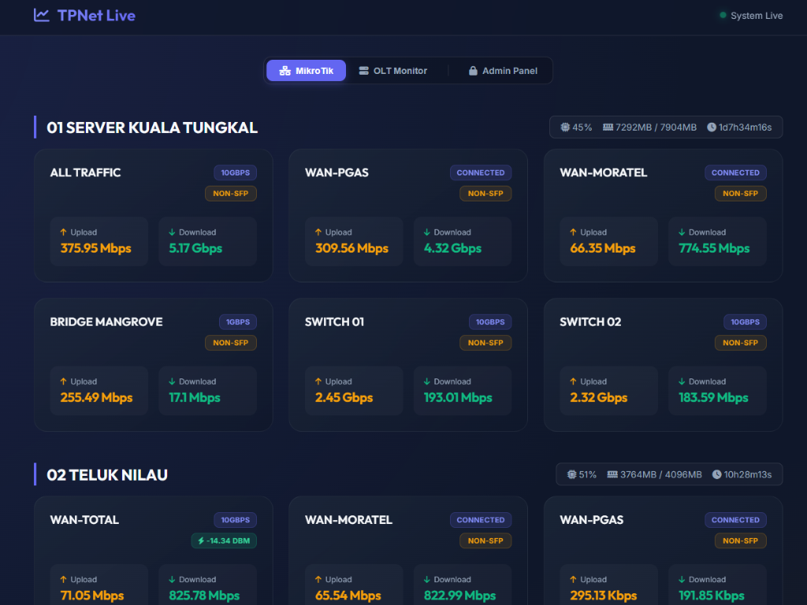
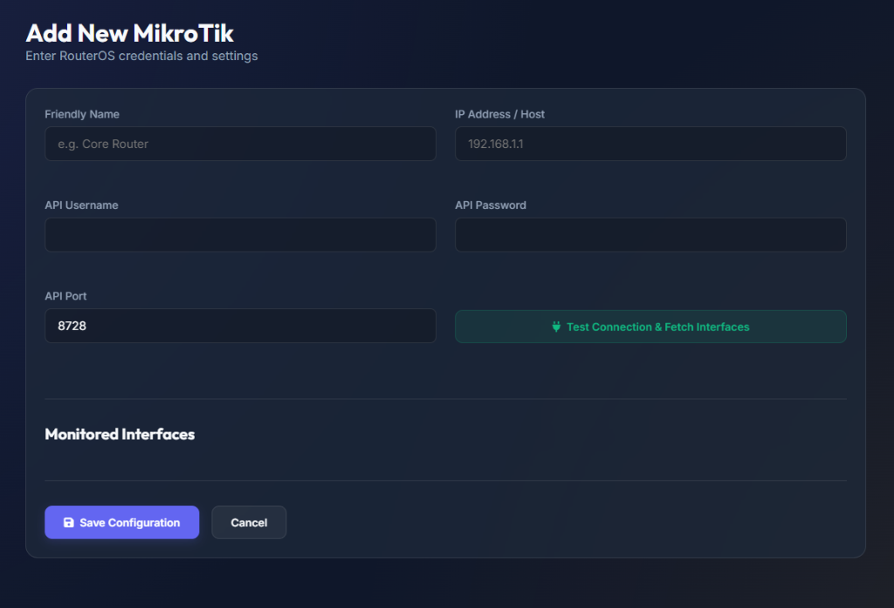

<p align="center">
  
</p>

<h1 align="center">MiksTraffic - MikroTik & OLT Monitoring System</h1>

<p align="center">
  <strong>Aplikasi monitoring trafik jaringan berbasis web yang sangat ringan, cepat, dan dilengkapi notifikasi WhatsApp.</strong><br>
  Sangat cocok untuk RT/RW Net atau ISP skala kecil-menengah yang membutuhkan sistem pantau *real-time* tanpa konfigurasi yang rumit.
</p>

---

## ✨ Fitur Unggulan

### 📊 Real-Time & Historical Traffic
Pantau terus pergerakan *bandwidth* di jaringan Anda. MiksTraffic menyimpan data historis untuk mempermudah analisis kapasitas jaringan.
- **Live Traffic**: Pembaruan per 1 menit secara mulus (*spanGaps* support).
- **History**: Lihat kilas balik data 24 Jam, Mingguan, hingga Bulanan.



### 🔌 Multi-Router & Multi-Interface
Tidak terbatas hanya pada satu router. Anda bisa mengkoneksikan banyak router MikroTik sekaligus dalam satu *dashboard*.
- Pilih *interface* mana saja yang ingin dipantau (WAN, Bridge, SFP, dll).
- Informasi OLT Status terintegrasi.



### 📲 WhatsApp Alert Notifications (Baileys)
Dapatkan peringatan seketika saat trafik jaringan Anda anjlok atau putus!
- Notifikasi dikirim otomatis via API WhatsApp Baileys.
- *Threshold* (Batas bawah trafik) dapat disesuaikan.
- Interval pengecekan aman dari *spam*.

### 👥 Multi-Admin Management
Sistem *login* yang aman dengan kemampuan untuk menambah banyak akun administrator untuk tim NOC Anda.



---

## 🛠️ Prasyarat Sistem

Aplikasi ini tidak membutuhkan spesifikasi *server* yang tinggi. Cukup dengan sistem operasi Linux standar:
- **Web Server**: Nginx atau Apache
- **PHP**: Versi 7.4 atau 8.x (Wajib memiliki ekstensi `sqlite3`, `curl`, dan `json`)
- **PM2**: Dibutuhkan untuk menjalankan *background daemon* (Install via `npm install -g pm2`).
- **Database**: SQLite (Bawaan PHP, tidak perlu *setup* MySQL/MariaDB).

---

## 🚀 Panduan Instalasi (Deployment)

### 1. Download & Ekstrak
Pindahkan seluruh isi repositori ini ke dalam direktori publik web server Anda (contoh: `/var/www/html/MRTG`).

### 2. Atur Hak Akses (Permissions)
Aplikasi ini membutuhkan hak tulis (*Write Permission*) pada folder `data` agar SQLite dapat membuat file database.
```bash
cd /var/www/html/MRTG
sudo chmod -R 777 data
```

### 3. Akses Dashboard Pertama Kali
Buka alamat aplikasi di browser Anda (misal: `http://ip-server/MRTG`). Aplikasi akan melakukan *auto-migrate* dan membuat database kosongan yang siap digunakan.

Gunakan kredensial bawaan berikut untuk masuk:
> **Username**: `admin` <br>
> **Password**: `admin123`

*(⚠️ Sangat disarankan untuk langsung mengubah password ini di menu Settings setelah login!)*

### 4. Menjalankan Perekam Data (Daemon)
Agar aplikasi dapat terus merekam trafik setiap waktu dan menjalankan fungsi *checker* WhatsApp, Anda **wajib** menjalankan *background service* menggunakan **PM2**.

```bash
# Pastikan Anda berada di dalam folder MRTG
cd /var/www/html/MRTG

# Berikan hak eksekusi pada script bash
chmod +x daemon_curl.sh
chmod +x daemon_wa.sh

# (OPSIONAL) Ubah variabel URL di dalam kedua file tersebut 
# agar sesuai dengan IP atau Domain Anda jika diperlukan.

# Jalankan daemon ke dalam PM2
pm2 start bash --name mrtg-recorder -- daemon_curl.sh
pm2 start bash --name mrtg-wa-checker -- daemon_wa.sh

# Simpan state PM2 agar berjalan otomatis saat server restart
pm2 save
pm2 startup
```

---

## ⚙️ Pengaturan Notifikasi WhatsApp
Untuk mengaktifkan fitur WhatsApp Alert:
1. Pergi ke menu **Settings** di Admin Panel.
2. Pada bagian WhatsApp Notifications, masukkan:
   - **Baileys API URL**: Endpoint API pengirim pesan Anda.
   - **Target Phone Number**: Nomor WA tujuan lengkap dengan kode negara (contoh: `62812...`).
   - **Traffic Threshold**: Batas bawah trafik dalam Mbps.
   - **Check Interval**: Jarak antar pengecekan dalam menit.

---

## 💡 Troubleshooting
- **Grafik Tidak Bergerak**: Pastikan `mrtg-recorder` berjalan di PM2. Cek dengan perintah `pm2 logs mrtg-recorder`.
- **Tidak Bisa Login**: Periksa kembali hak akses `chmod 777` pada folder `data`.

---
<p align="center">
  Dibuat dengan ❤️ untuk Network Engineer.
</p>
